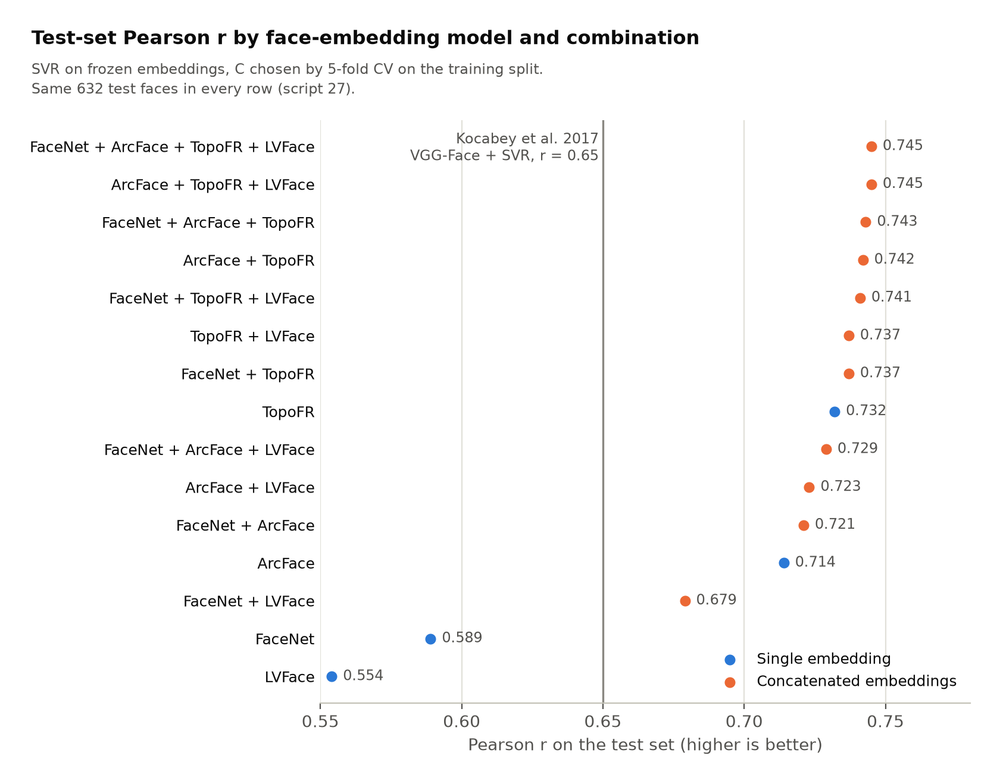
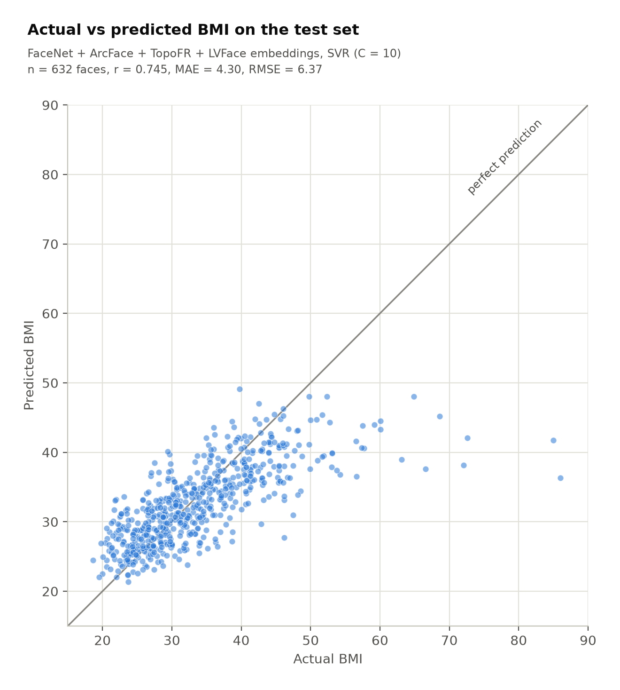

# Face-to-BMI

Predicting body mass index (BMI) from a face photo with pretrained face-recognition embeddings and support vector regression.

Team project for Machine Learning II (ADSP 31018), MS in Applied Data Science, University of Chicago, Spring 2026.
Team 8: Estella Hu, Ginger Zhou, Hoon Yum, Mike Li, Yingqi Chen.

## What it does

The project replicates the pipeline of Kocabey et al. (2017), "Face-to-BMI: Using Computer Vision to Infer Body Mass Index on Social Media" (ICWSM 2017), which reported a test-set Pearson correlation of r = 0.65 using VGG-Face features and support vector regression (SVR).

Each photo goes through a face detector and a frozen face-recognition network, which returns a 512-number embedding. An SVR then maps the embedding to a BMI value. We tested which part of this pipeline limits accuracy, tried fine-tuning the network end to end, and wrapped the best model in a Streamlit demo.

Switching from FaceNet to ArcFace embeddings raised test r from 0.572 to 0.690, while changing the regressor moved it by 0.01 or less. Follow-up runs written after the course report (scripts 17 to 27) tuned the SVR and concatenated embeddings from several models. The best combinations reach r = 0.742 to 0.745.

## Data

- **Source.** The VisualBMI dataset from Kocabey et al. (2017). The photos come from Reddit's r/progresspics, where people post before-and-after pictures with their height and weight; BMI was computed from those self-reported numbers. The course provided a copy with a label file (`bmi`, `gender`, `is_training`, `name`).
- **Size.** 4,206 labeled faces with a predefined split of 3,368 train and 838 test, the same split as the paper. Some listed images were missing from the provided folder and face detection failed on others, so the usable sets are smaller. FaceNet's detector (MTCNN) produced embeddings for 3,954 faces (3,204 train, 750 test). The InsightFace detector used for ArcFace, AdaFace, TopoFR and LVFace produced 3,208 (2,575 train, 633 test).
- **Label distribution.** Mean BMI 32.8, SD 8.3, range 17.7 to 86.0. 56% of labels are 30 or above and only 7 are below 18.5.
- **Not included.** This repository contains no images, no label file, no extracted embeddings (`features/*.npz`) and no trained models (`*.pth`, `*.pkl`). The photos show real people who posted them for another purpose, and the labels are health information tied to those faces. Embeddings and models fitted on them are derived from the same faces, so they are left out as well. The data was provided to the class for this project and is not redistributed here. To run the code you need your own authorized copy of VisualBMI.

## Approach

1. **Frozen embeddings plus SVR.** FaceNet (InceptionResnetV1 pretrained on VGGFace2, MTCNN alignment, `04_extract_all.py`) and ArcFace (InsightFace `buffalo_l`, `09_extract_arcface.py`) each give a 512-dimensional embedding per face. Embeddings are standardized and fed to an RBF-kernel SVR fit on the training split.
2. **Bottleneck analysis.** With FaceNet embeddings held fixed, we changed only the regression step: SVR with C picked by cross-validation (`07`), XGBoost (`08`), and an added gender feature (`06`). All landed near r = 0.57. With the SVR held fixed, switching to ArcFace embeddings (`10`) gave r = 0.690. The embedding was the limiting part.
3. **Fine-tuning attempt.** We unfroze the whole FaceNet backbone, added a small head (512 to 64 to 1), and trained for 50 epochs with learning rate 1e-4 and MSE loss on raw BMI (`11` to `15`). According to the course report, training loss fell from 1,079 to 65 but test r stayed near zero, because the model predicted close to the mean for every face. Two later variants are included: `13_train_v2.py` (partial unfreezing, normalized targets, separate learning rates) and `13_train_v3.py` (v2 plus augmentation). Their results were not recorded in the project files.
4. **Follow-up after the report: SVR tuning and embedding combinations** (scripts 17 to 27). C is picked by 5-fold cross-validation on the training split, except in `17_ensemble_svr.py`, which keeps C = 1. Embeddings from several models are concatenated before the SVR: FaceNet, ArcFace, TopoFR (ResNet-100 trained on Glint360K), LVFace (ViT-B trained on Glint360K, run through ONNX), and in separate tests AdaFace (IR-101 via CVLFace) and the fine-tuned FaceNet backbone. `27_final_ensemble.py` scores all 15 combinations of FaceNet, ArcFace, TopoFR and LVFace on the same 3,203 faces (632 in test).

## Results

All numbers are on the predefined test split. The Source column says where each number comes from:

- **Re-run**: printed by the listed script when it was run again on the saved embeddings (October 2026; numpy 1.26.4, scikit-learn 1.9.1, xgboost 3.2.0). Where the course report has the same row, the values match it exactly.
- **Re-run (check)**: computed with the same model as the listed script, because the script itself does not print it.
- **Report**: taken from the course report. Not re-run, because it needs the images and a GPU fine-tuning run.

### Course experiments (scripts 06 to 15)

| Model | Script | Test n | Pearson r | MAE | RMSE | Source |
|---|---|---|---|---|---|---|
| VGG-Face + SVR (Kocabey et al. 2017) | | | 0.65 | | | Paper, as cited in the report |
| FaceNet + SVR (C = 10, gender feature added) | `06` | 750 | 0.572 | 5.49 | 7.69 | Re-run |
| FaceNet + SVR (C = 1, picked by 3-fold CV) | `07` | 750 | 0.577 | 5.50 | not printed | Re-run |
| FaceNet + XGBoost | `08` | 750 | 0.562 | 5.51 | 7.70 | Re-run |
| **ArcFace + SVR (C = 1), course best model, used in the demo** | `10` | 633 | **0.690** | 5.37 | 7.78 | Re-run |
| FaceNet fine-tuned end to end | `13`, `15` | | -0.026 | 7.09 | 9.35 | Report |

Pearson r by gender:

| Model | Male r (n) | Female r (n) | Source |
|---|---|---|---|
| VGG-Face + SVR (Kocabey et al. 2017) | 0.71 | 0.57 | Paper, as cited in the report |
| FaceNet + SVR (`06`) | 0.597 (427) | 0.544 (323) | Re-run |
| ArcFace + SVR, C = 1 (`10`) | 0.695 (374) | 0.704 (259) | Re-run (check) |

MAE by actual BMI range for ArcFace + SVR, C = 1 (Re-run (check)): 5.77 for 18.5 to 25 (n = 104), 2.70 for 25 to 30 (n = 161), 6.43 for 30 and above (n = 368). The test set has no faces below 18.5.

### Follow-up after the report

| Embeddings | Script | Test n | C | Pearson r | MAE | RMSE | Source |
|---|---|---|---|---|---|---|---|
| ArcFace | `18` | 633 | 10 | 0.714 | 4.59 | 6.68 | Re-run |
| FaceNet + ArcFace | `17_ensemble_svr` | 632 | 1 | 0.673 | 5.15 | 7.52 | Re-run |
| FaceNet + ArcFace | `17_ensemble_tuned` | 632 | 10 | 0.721 | 4.44 | 6.56 | Re-run |
| FaceNet + ArcFace + fine-tuned FaceNet (see note) | `21` | 632 | 50 | 0.587 | 5.27 | 7.56 | Re-run |
| ArcFace + AdaFace | `23` | 633 | 10 | 0.724 | 4.52 | 6.59 | Re-run |
| FaceNet + ArcFace + TopoFR | `25` | 632 | 10 | 0.743 | 4.30 | 6.37 | Re-run |

Script 27 compares every combination of FaceNet, ArcFace, TopoFR and LVFace on one shared set of 3,203 faces (632 test), so these rows are directly comparable. All are Re-run, listed in the script's own ranking order:

| Rank | Embeddings | Pearson r | MAE | C |
|---|---|---|---|---|
| 1 | FaceNet + ArcFace + TopoFR + LVFace | 0.745 | 4.30 | 10 |
| 2 | ArcFace + TopoFR + LVFace | 0.745 | 4.38 | 10 |
| 3 | FaceNet + ArcFace + TopoFR | 0.743 | 4.30 | 10 |
| 4 | ArcFace + TopoFR | 0.742 | 4.40 | 10 |
| 5 | FaceNet + TopoFR + LVFace | 0.741 | 4.35 | 10 |
| 6 | TopoFR + LVFace | 0.737 | 4.45 | 10 |
| 7 | FaceNet + TopoFR | 0.737 | 4.35 | 10 |
| 8 | TopoFR | 0.732 | 4.49 | 10 |
| 9 | FaceNet + ArcFace + LVFace | 0.729 | 4.43 | 10 |
| 10 | ArcFace + LVFace | 0.723 | 4.57 | 10 |
| 11 | FaceNet + ArcFace | 0.721 | 4.44 | 10 |
| 12 | ArcFace | 0.714 | 4.59 | 10 |
| 13 | FaceNet + LVFace | 0.679 | 4.84 | 10 |
| 14 | FaceNet | 0.589 | 5.33 | 5 |
| 15 | LVFace | 0.554 | 5.61 | 10 |

The scatter plot below shows the rank 1 combination. Its RMSE (6.37) is not printed by script 27 and comes from a Re-run (check) of the same model.





### Reading these numbers

- TopoFR was the strongest single embedding (0.732) and LVFace the weakest (0.554, below FaceNet). Adding models helps up to a point: every combination that pairs TopoFR with at least one other model lands between 0.737 and 0.745, so the gains flatten out around r = 0.74.
- The test set has 632 faces. A 95% bootstrap interval for the rank 1 model's r runs from 0.70 to 0.78, far wider than the gaps between the top combinations, so treat those as tied. The ranking was also read off the same test set that produced the scores, because there is no separate validation split, which makes the top number slightly optimistic.
- Predictions are still pulled toward the middle. For the rank 1 model, faces with an actual BMI of 40 or more are underestimated by 7.9 points on average (n = 139), and faces under 25 are overestimated by 3.8 (n = 104).
- C = 1 means strong regularization for this target (BMI is not scaled), and it squeezes predictions toward the mean: for ArcFace + SVR at C = 1 the predictions have an SD of 2.9 against 9.2 for the actual values. Raising C to 10 cut MAE from 5.37 to 4.59.
- Do not read the fine-tuned FaceNet row (`21`) as a fair result. It has two problems. `13_train_v2.py` keeps the epoch with the best test r, so the test set helped pick that model. The backbone was also trained on the same training faces, so its embeddings already encode their labels, which is why cross-validation inside script 21 reported an MAE near 1.1 while the test MAE was 5.27.
- The course runs compared FaceNet and ArcFace on different face subsets (750 vs 633 test faces) because the two detectors fail on different images. Script 27 removes that difference by using only faces both detectors found.

## Demo

`app.py` is a Streamlit app. You upload a photo or take one with the webcam; InsightFace finds the most confident face and computes its ArcFace embedding; the saved ArcFace + SVR pipeline (C = 1, the course best model) returns a BMI estimate with its WHO category and a disclaimer.

The trained model file is not in this repository. To run the app, build `arcface_svr_model.pkl` from your own copy of the data with `09_extract_arcface.py` and `16_save_arcface_model.py`, then run `streamlit run app.py` and open http://localhost:8501.

## Ethics and limits

- This is a study of population-level signal in face photos. It is not a tool for judging any individual. Typical error is 4 to 5 BMI points, about the width of the 25 to 30 "overweight" band, so a single prediction can land in the wrong WHO category.
- The data is self-selected: people posting weight-loss progress on Reddit. Most labels are high, only 7 of 4,206 are underweight, and BMI comes from self-reported height and weight. The model underestimates very high BMI and has almost nothing to learn from at the low end.
- Accuracy differs by group. FaceNet + SVR was better for men (r 0.597 vs 0.544), while ArcFace + SVR was close for both (0.695 vs 0.704). The labels include only a binary gender field and nothing on age, race or skin tone, so other gaps cannot be measured with this data.
- Face detection failed on part of the images (InsightFace found faces in 3,208 of about 3,960 available), and those failures may not be random across groups.
- Estimating health traits from faces can be misused, for example in hiring, insurance or surveillance. The people in the dataset did not agree to this use. Do not run the demo on photos of anyone who has not agreed to it.

## Team

Estella Hu, Ginger Zhou, Hoon Yum, Mike Li and Yingqi Chen (Team 8). The course report, slides and the code in this repository were the team's final project for Machine Learning II (ADSP 31018), Spring 2026.

## My role

Team project. I wrote `13_train_v3.py` and, after the report, the follow-up experiments in scripts 17 to 27: the FaceNet plus ArcFace ensembles, the AdaFace, TopoFR and LVFace embeddings, and the final comparison of all combinations, which reached Pearson r = 0.742 to 0.745 against 0.690 for the course model. I also worked on the course pipeline and the Streamlit demo with the team. Teammates took the lead on the report, the slides and the research-topic presentation.

## Repository layout

| Script | What it does |
|---|---|
| `02_read_labels.py` | Load and inspect the label file |
| `03_one_embedding.py` | One image to one FaceNet embedding (smoke test) |
| `04_extract_all.py` | FaceNet embeddings for all images, saved to `features/facenet_embeddings.npz` |
| `05_load_split.py` | Load embeddings and split by `is_training` |
| `06_train_svr.py` | FaceNet + SVR baseline, with results by gender and BMI range |
| `07_tune_svr.py` | Pick SVR C for FaceNet with 3-fold CV |
| `08_xgboost.py` | XGBoost on FaceNet embeddings |
| `09_extract_arcface.py` | ArcFace embeddings, saved to `features/arcface_embeddings.npz` |
| `10_train_arcface_svr.py` | ArcFace + SVR, the course best model |
| `11_model.py`, `12_dataset.py` | FaceNet backbone with a BMI head, and the PyTorch dataset |
| `13_train.py`, `13_train_v2.py`, `13_train_v3.py` | Fine-tuning: full, partial with normalized targets, partial with augmentation |
| `14_predict.py`, `15_eval_finetuned.py` | Single-image inference and test evaluation for the fine-tuned model |
| `16_save_arcface_model.py` | Fit ArcFace + SVR on the training split and save it for the app |
| `17_ensemble_svr.py`, `17_ensemble_tuned.py` | FaceNet + ArcFace, with C = 1 and with tuned C |
| `18_tune_arcface_svr.py` | ArcFace alone with tuned C |
| `20_extract_finetuned_embeddings.py`, `21_triple_ensemble.py` | Embeddings from the fine-tuned backbone, then FaceNet + ArcFace + fine-tuned FaceNet |
| `22_extract_adaface.py`, `23_ensemble_arcface_adaface.py` | AdaFace embeddings, then ArcFace + AdaFace |
| `24_extract_topofr.py`, `25_triple_diverse_ensemble.py` | TopoFR embeddings, then FaceNet + ArcFace + TopoFR |
| `26_extract_lvface.py`, `27_final_ensemble.py` | LVFace embeddings, then all 15 combinations of four models |
| `app.py` | Streamlit demo |

There is no script 19. Comments in scripts `13_train_v3.py` and 17 to 26 are in Korean, as are some printed labels in scripts 17 to 25.

## How to run

Run every script from the repository root; paths such as `data/data.csv` and `features/` are relative. The code uses Apple's MPS GPU when available and runs MTCNN on the CPU.

```bash
conda create -n bmi python=3.11
conda activate bmi
pip install -r requirements.txt
```

Expected local folders, all ignored by git:

```
data/data.csv          label file
data/Images/           face images (.bmp)
features/              embeddings written by the extraction scripts
third_party/           outside model code and weights for scripts 22, 24, 26
```

Course pipeline:

```bash
python 04_extract_all.py          # FaceNet embeddings
python 09_extract_arcface.py      # ArcFace embeddings
python 06_train_svr.py            # FaceNet + SVR
python 07_tune_svr.py
python 08_xgboost.py
python 10_train_arcface_svr.py    # ArcFace + SVR
python 13_train.py                # fine-tuning (slow), then:
python 15_eval_finetuned.py
python 16_save_arcface_model.py   # model file for the app
streamlit run app.py
```

Once the `features/*.npz` files exist, the regression and combination scripts (06 to 08, 10, 16 to 18, 21, 23, 25, 27) need only numpy, scipy, scikit-learn and xgboost. On a 2-core machine script 27 took about 10 minutes and the others under 2 minutes each.

Follow-up runs:

```bash
python 18_tune_arcface_svr.py
python 17_ensemble_svr.py
python 17_ensemble_tuned.py
python 13_train_v2.py && python 20_extract_finetuned_embeddings.py && python 21_triple_ensemble.py
python 22_extract_adaface.py && python 23_ensemble_arcface_adaface.py
python 24_extract_topofr.py && python 25_triple_diverse_ensemble.py
python 26_extract_lvface.py && python 27_final_ensemble.py
```

Scripts 22, 24 and 26 load outside model code and weights from `third_party/cvlface_adaface`, `third_party/TopoFR` and `third_party/LVFace`. Get each one from its official release, follow its license, and match the file paths at the top of each script. They also need packages that are not in `requirements.txt` (script 22 imports `omegaconf` and `yaml`, for example).

## Reference

Kocabey et al. (2017). Face-to-BMI: Using Computer Vision to Infer Body Mass Index on Social Media. Proceedings of the Eleventh International AAAI Conference on Web and Social Media (ICWSM).
